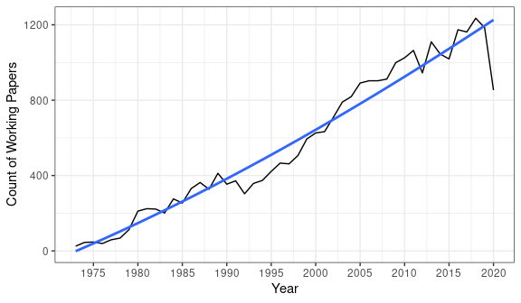
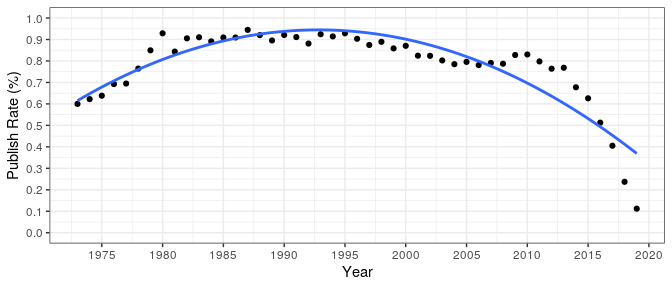
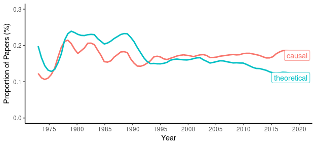
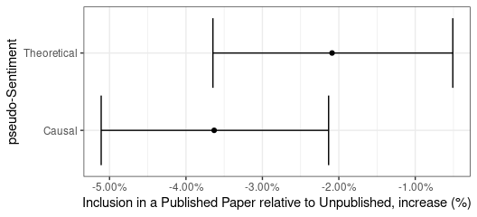

Working Papers in Economics: the NBER Series
================
Senan Hogan-Hennessy,
04 Jun 2020

Publishing is a main goal of academic economists, but rarely is it as
simple as write the paper then publish. Projects can take years and
often transform over work, data analysis and dissemination of results.
An important part of gauging the impact of research in progress is
releasing a working paper. The National Bureau of Economic Research
(NBER) hosts a heavily circulated [series](https://www.nber.org/papers)
for its affiliates to register working papers, and the series includes
pre-published versions of some very famous research papers and some
heavily cited working papers themselves.

> \`\`We owe a tremendous amount to the NBER working Paper series. It
> has filled a huge gap in in our ability to disseminate knowledge
> before publication \[…\], sharing knowledge as it is produced.’’
> 
> – Claudia Goldin, 2014 at a conference on the NBER history.
> <!-- Presentation on the series : https://www.nber.org/WPat20K/summary.html# -->

This is the first of a series of blog posts motivating my analysis and
exploration of a huge set of data on economics publications, sho I hope
you enjoy the posts. The source code is available in [this
repo](https://github.com/shoganhennessy/Econ_text_data/), so feel free
to look over and reproduce from there (which is filled mostly with code
in *R* and *Python*). Please contact me if you would like to use my
underlying data for another project – all of the used data are publicly
accessible across the internet yet my collection of them all constitute
sensitive information.

### The dataset

I have retrieved the listing of all NBER working papers, a collection of
27431 papers (as of 25 Jun 2020), starting with a small number of
technical reports in 1973 to hundreds of modern research papers every
year in the 2000s.

The series has constantly been growing as a source of presentable
research in-progress. It is unclear whether the growth in size of this
listing is because of the rise in release of working papers in general,
or because of an individual rise in the use of the NBER series. It is
clear, however, that the internet has been a major part of disseminating
research in-progress, as before the online listing of working papers
researchers would only have the chance to read colleague manuscripts in
person or at conferences. Today we can take a phone from our pockets,
google something like ‘NBER working paper on economics publishing’ and
read cutting edge research before it is even published.

The papers are sorted in to subjects areas, the [NBER research area
programmes](https://www.nber.org/programs/) (the graph below only shows
top 10 areas). Note, however, that papers can be cross registered to
multiple areas, and are more likely to be so for recent years.

Most of the papers go on to be published, but the rate of publishing is
certainly not constant. In the early days, around 60% of the working
papers are published in peer reviewed journals, going on to peak at 94%
in 1987 before falling to common day. What drives this rise and fall? It
is clear that papers since 2015 are still in the pipeline: the NBER
series was, afterall, started partially to disseminate current knowledge
in light of publication lags.

Yet the publication rate has not been constant even before 2015. What
explains the changes in publication rate among these working papers?

### Textual difference

It’s unclear whether there is an observable difference between the
published and non-published papers – other than the outcome itself\! We
have access to the abstract of every paper, however, so I was inspired
by the David Robinson’s famous blog
[post](http://varianceexplained.org/r/trump-tweets) to investigate the
text with some tools in R – take a look
[here](https://github.com/shoganhennessy/Econ_text_data/blob/master/Blog_post_exploration/Working_papers_intro.Rmd)
if you want to follow the code. First take a look at the most common
words used for each classification.

Most common for published articles: model, data, market, effects, rate,
policy, tax, capital, countries, rates.

Most common for the unpublished: model, data, market, effects, growth,
firms, rate, policy, countries, capital.

The ten most common words are almost identical across publication
outcome, so this hardly counts as a textual difference. However, a raw
word count measure is a crude measure that can be affected by
confounding factors. Instead consider a log odds ratio to show which
words are relatively more likely to be in (eventually) published papers.

  - Bubble is most likely to be among published papers, temperature
    among those not published. Bubble can most commonly be associated
    with asset bubbles, an extremely popular topic in economics since
    2008 where the NBER series has really grown, so it seems papers
    involving bubbles are most likely to reach publication fruition.
    Temperature on the other hand is the opposite; perhaps economics
    papers on climate change aren’t doing quite as well, it after all
    does not even have its own NBER research programme oustude of the
    energy subfield.

  - Unpublished words involve a few health-related words, such as
    pharmaceutical and uninsured – health economics working papers are
    not actually less likely to be published, so it’s not clear what
    significance these words play. The second through seventh words have
    a connection to public economics, with some successful papers
    relating to tax credits (some unanticipated).

  - Algorithm and identification are words related to more recent
    advances in empiricsm and new software, yet are more likely to be in
    unpublished papers. It’s suprising to me that empiricism does not
    play an obvious role here, yet the issue could do with further
    digging.

### Empiricism & Causal Inference

Economics is far more concerned with empirical, causal inference than
when the NBER series began in 1973: let’s show this <i>empirically</i>.

Sentiment analysis is commonly applied to text data as an easy coding
operation to measure sentiment – commonly to measure happiness, or
perhaps [1am angry tweets](http://varianceexplained.org/r/trump-tweets/)
– and the same process can textually measure alignment with causal or
theoretical papers. First I’ll form a list of a hundred words most
likely to appear in abstracts that use the word ‘causal’ – denoting
these as causal papers. Also list the top hundred words in papers that
use the words ‘theory’ and ‘equilibrium’ – denoting these theoretical
papers.

A listing of words most likely (relatively) to appear in a causal or
theoretical paper can play the role of a sentiment dictionary (call it a
a pseudo sentiment lexicon) with a log ratio of inclusion in the type of
paper, where a value of 100 is the most likely to be a word in that type
of paper. It easily reframes the topic of measuring causal inference in
the working papers as simple sentiment classification problem.

Here are the top 10 for causal papers with scores:

causal : 100, caused : 93, causality : 79, caused : 71, granger : 65,
causal : 63, asbestos : 61, pipes : 61, autism : 59, causally : 59.

And for theoretical papers:

equilibrium : 100, equilibrium : 83, equilibria : 74, equilibria : 73,
theory : 71, theory : 67, disequilibrium : 66, guarantees : 60, sunspot
: 59, tpp : 56.

<!-- Dictionary-based sentiment -->

<!-- https://cbail.github.io/SICSS_Dictionary-Based_Text_Analysis.html#dictionary-based-quantitative-text-analysis -->

Take a step back and make sure the words make sense – one would hope
that ‘causality’ is a causal word, and that ‘theory’ is a theoretical
word\!

The list of causal or theoretical words are then counted among published
and unpublished (pre-2016) papers, and a Poisson count test to estimate
whether they are more likely to be in published or unpublished papers.
Both estimates are negative, as in both types are words are less likely
to be in a published paper than a standard word, with overlap in the
plausible estimate regions.

To see in granular detail, the words at the extreme of these sentiments
within published and unpublished papers.

Take a look at the words used here. I can’t, for one, draw a specific
difference in themes, so perhaps the NBER papers that do get published
vs unpublished really are not so different\!

### Conclusion: the wider economics publishing pipeline

This was a quick dive in to some data I’ve been collecting and working
with recently, a way of documenting things that I have looked over,
practising writing at the same time.

I hope you enjoyed the post; I have some bigger ideas in the work beyond
the scope of publication outcomes of the NBER working papers. Follow for
updates over the next few months as I collect more data sources, get a
better idea of what I’m dealing with and form a more direct research
question.

*Note:* text analysis methods and code in *R* are inspired by an [older
post on political tweets](http://varianceexplained.org/r/trump-tweets),
which I also thoroughly recommend.

**Next up:** A dive in to a more complete source of economics research
papers.
