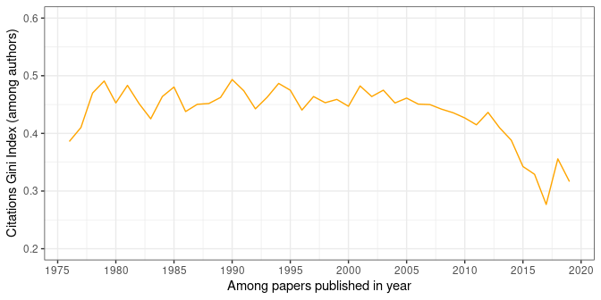
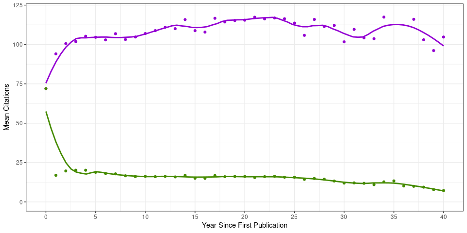
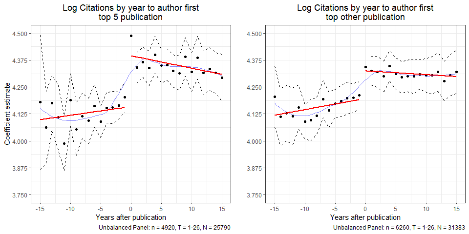
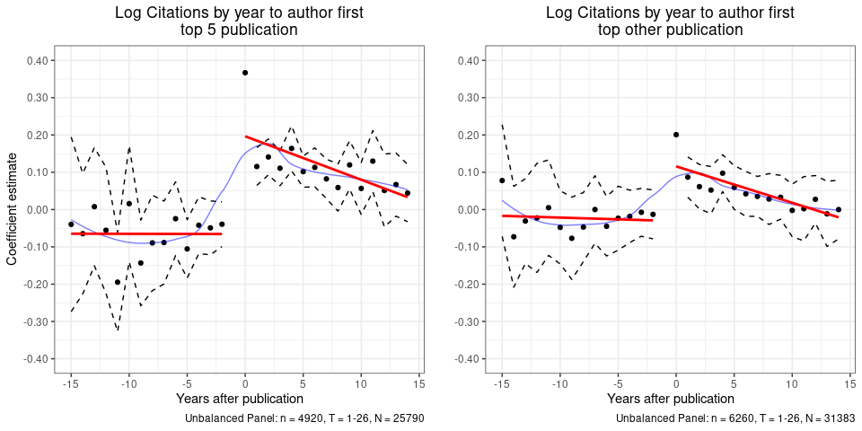

The Ideas.RePEc Listings of Articles in Economics
================
Senan Hogan-Hennessy,
04 Feb 2020

## WORK IN PROGRESS – to be finished soon.

The NBER series is a great source of research in our profession, but it
isn’t the full picture of research in the field. It is, after all, a
listing of working papers which are by definition not yet publications –
though most do go on to be published, as I noted in the [last
post.](https://github.com/shoganhennessy/Econ_text_data/blob/master/Blog_post_exploration/1_NBER_working_papers.md)

Forunately, [Research Papers in Economics (RePEc)’s
Ideas](https://ideas.repec.org/) provides a large listing of economics
research which I can use as a complement to the NBER listings as it
lists information on 57532 economists and 421348 published articles
papers – considering only those in English as of 9 January 2020.

> ‘’IDEAS is the largest bibliographic database dedicated to Economics
> and available freely on the Internet. Based on RePEc, it indexes over
> 3,000,000 items of research, including over 2,700,000 that can be
> downloaded in full text.’’
> 
> – What is IDEAS? [Ideas.RePEc.org/](https://ideas.repec.org/)

421348 is a huge number of articles to consider, and comparable in size
to articles that use the near complete set of
publcations.[1](#f1) RePEc has certain advantages: it
is more open and it has a clear link to authors – and importantly some
of their characteristics – to working and published papers, all within
the field of economics. It is however, a repository only within the
economics sphere: citations are only counted among other papers in the
database, and not among the universe of publications.

### Citations

For a sanity check, take a look at the most prolific authors in the
field by citation
count.[2](#f2)

| author\_name                  | total\_citations | mean\_citations | total\_articles |
| :---------------------------- | ---------------: | --------------: | --------------: |
| Andrei Shleifer               |            13816 |             150 |              92 |
| James J. Heckman              |            12845 |             130 |              99 |
| Daron Acemoglu                |            12007 |             111 |             108 |
| Jean Tirole                   |            11602 |             130 |              89 |
| Joseph E. Stiglitz            |            11070 |             101 |             110 |
| René M. Stulz (Rene M. Stulz) |             9884 |             145 |              68 |
| John List                     |             8559 |              93 |              92 |
| John Y. Campbell              |             8423 |             153 |              55 |
| David E. Card                 |             8159 |             138 |              59 |
| Asli Demirguc-Kunt            |             8150 |             143 |              57 |

There are some familiar faces among the names, which is to be expected\!
The process of assigning is, however, not perfect: citations are
assigned from each article to each author equally when there are
multiple authors. Yet [Sarsons
(2017)](https://www.aeaweb.org/articles?id=10.1257/aer.p20171126) shows
how innapropriate this accounting is by exhibiting the unequal citation
rate of return in among economists by gender – which actually inspired
me to work with economics publishing data in the first place\! Call it a
point of interest to rank economists by better measures as this project
progresses.

Citations are, of course, not evenly distributed across researchers in
the field; the above top ten are at the very top of the field. But what
does the wider distribution look like?

Draw a Gini coefficient for citations among authors per year.

Think about whether sharing of publications/work over the internet leads
to more or less inequality -\> perhaps a better question for the
upcoming network analyses.

### The Top 5

Economists aim for the top 5. READ OVER:

Gibson, J, D L Anderson and J Tressler (2017), “Citations or journal
quality: Which is rewarded more in the academic labor market?” Economic
Inquiry 55(4): 1945–1965.

Hamermesh, D S (2018), “Citations in economics: Measurement, uses, and
impacts,” Journal of Economic Literature 56(1):
115–56.

<https://voxeu.org/article/publishing-and-promotion-economics-tyranny-top-five>

<https://www.nber.org/papers/w25093>

Top Five journals in economics: the American Economic Review,
Econometrica,the Journal of Political Economy,the Quarterly Journal of
Economics, and the Review of Economic Studies.

> Indeed, serious theoretical and empirical work should be conducted to
> understand this disease better and suggest possible treatments. The
> problem will probably require challenging techniques in applied
> mechanism design.
> 
> – [Top5itis, R Serrano (2018)](http://hdl.handle.net/10419/202594)

\-\> measure citations from making a top 5, and follow on. ^Note that
the graph or statistics on that LOOK like some causal identification of
the effect, which is not the case yet, so be careful to not use causal
language.

SHow how many articles in the top 10. The accepted top 5 is not the top
5 by total or mean citation count, documented previously in (Anauati et
al. 2018 NBER WP
25101).

| journal\_title                         | mean\_citations | total\_citations | total\_articles |
| :------------------------------------- | --------------: | ---------------: | --------------: |
| American Economic Review               |             102 |           301142 |            2954 |
| Journal of Political Economy           |             112 |           142477 |            1271 |
| The Quarterly Journal of Economics     |             137 |           129378 |             945 |
| Econometrica                           |             103 |           129028 |            1247 |
| The Review of Economics and Statistics |              84 |            97737 |            1169 |
| Journal of Finance                     |             112 |            97687 |             870 |
| Economic Journal                       |              83 |            93447 |            1132 |
| Journal of Financial Economics         |             107 |            92602 |             866 |
| Journal of Econometrics                |              84 |            89413 |            1068 |
| Journal of Public Economics            |              73 |            88089 |            1207 |

Draw a line graph for author cumulative citations, years after first
publication. NOTE: attributing citations to year of publication and not
year in which a reader cites the previous work in a new publication
(which I will consider later in network effects).

Draw a graph for author cumulative citations, years after first
publication in a top 5. Add a line for year after making a top 6-10
(weakly comparable).

NOTE: attributing citations to year of publication and not year in which
a reader cites the previous work in a new publication (which I will
consider later in network effects).

#### Re-do as an event study :

Draw equation for this
pseudo-*event*.

### Conclusion:

Describe data set and opportunity to measure economics publication
*outcomes*.

**Next up:** Looking at inclusion in the *NBER family*.

-----

<b id="f1">1</b> [Angrist et al.
(2017)](https://www.nber.org/papers/w23698) link Econlit and Web of
Science for similar coverage, for example.[↩](#a1)

<b id="f2">2</b> Again, note that this citation count is not the same as
that in the universe of academic publications or Google Scholar, it is a
count of the citations within the RePEc listings so a measure of
citations within only this large coverage of the field.[↩](#a1)

-----

## References

1.  Angrist, Joshua, et al. Inside job or deep impact? Using extramural
    citations to assess economic scholarship. No. w23698. National
    Bureau of Economic Research, 2017.
2.  Sarsons, Heather. Recognition for group work: Gender differences in
    academia. American Economic Review 107.5 (2017): 141-45.
3.  Serrano, Roberto. Top5itis. No. 2018-2. Working Paper, 2018.
