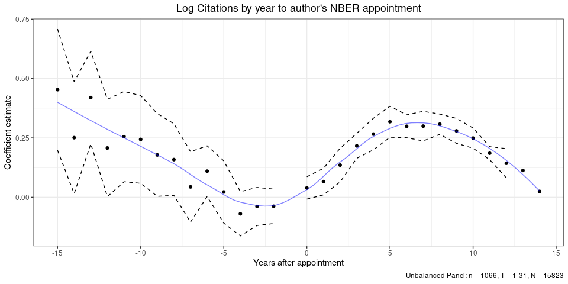

Senan Hogan-Hennessy,
27 Jul 2020

This is the second of a series of blog posts motivating my analysis and
exploration of a huge set of data on economics publications, sho I hope
you enjoy the posts. The source code is available in [this
repo](https://github.com/shoganhennessy/Econ_text_data/), so feel free
to look over and reproduce from there (which is filled mostly with code
in *R* and *Python*). Please contact me if you would like to use my
underlying data for another project – all of the used data are publicly
accessible across the internet yet my collection of them all may
constitute sensitive information.

-----

# NBER Inclusion, What is it Good For?

> I tried to post a comment on NBER (National Bureau of Economic
> Research), but was rejected for not being an approved “NBER family
> member”. If any of our readers is a ”NBER family member” feel free to
> post the above. – Judea pearl on Angrist (2017)
> <http://ideas.repec.org/a/aea/jecper/v31y2017i2p125-44.html>
> <!-- blog post at http://causality.cs.ucla.edu/blog/index.php/2017/02/ -->

Topic for blog post 3 is discussion of inclusion in nber — see quote
above. Draw some graphs of how NBER members fill the economics
publishing sphere, and establish the issue of benefits from NBER
membership. ^ Will require reforming the time series listing of fellow
appointments – easy work yet.

Think about whether sharing of publications/work over the internet leads
to more or less inequality -\> perhaps a better question for the
upcoming network analyses.

Look over the paper here: “Undergraduate Econometrics Instruction:
Through Our Classes, Darkly” Joshua D. Angrist, Joern-Steffen Pischke
<http://www.nber.org/papers/w23144>

Comment on the same here:
<https://p-hunermund.com/2017/02/22/judea-pearl-on-angrist-and-pischke/>

### Graph years since PhD

### Link to the NBER

Draw maps of where they"re from and test a correlation: distance to
publication home institution and economist base. ^ Start of testing
locality or inclusion.

### Coauthorship

Look at how much more likely to coauthor with other members after being
appointed.
