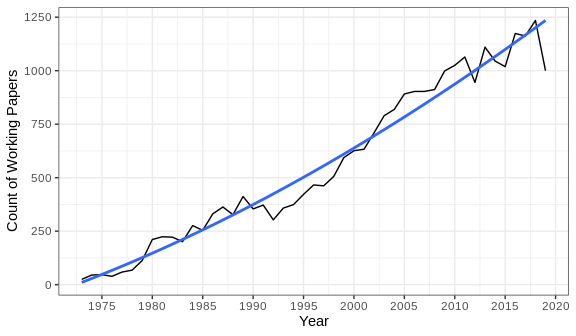
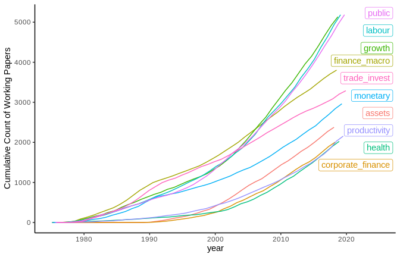
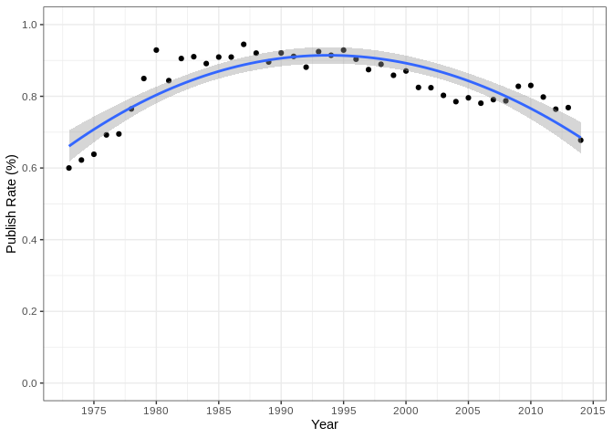

Working Papers in Economics: the NBER Series
================
Senan Hogan-Hennesssy
26 Dec 2019

## UNFINISED, TO BE COMPLETED OVER THE NEXT WEEK

<!-- Look at blog post   : http://varianceexplained.org/r/trump-tweets/#fnref:fullcode -->

<!-- Look at source code : https://github.com/dgrtwo/dgrtwo.github.com/blob/master/_R/2016-08-09-trump-tweets.Rmd -->

Publishing is a main goal of academic economists, but rarely is it as
simple as write the paper then publish. Projects can take years and
often transform over the work, data analysis and dissemination of
results. An important part of gauging the impact of research in progress
is releasing a working paper. The National Bureau of Economic Research
(NBER) hosts a heavily circulated [series](https://www.nber.org/papers)
for its affiliates to register working papers, and the series includes
pre-published versions of some very famous research papers and some
heavily cited working papers themselves.

> \`\`We owe a tremendous amount to the NBER working Paper series. It
> has filled a huge gap in in our ability to dissemniate knowledge
> before publication \[…\], sharing knowledge as it is produced.’’
> 
> – Claudia Goldin, 2014 at a conference on the NBER history.
> <!-- Presentation on the series : https://www.nber.org/WPat20K/summary.html# -->

### The dataset

I have retreieved the listing of all NBER working papers, a collection
of 26393 papers (as of 25 Oct 2019), starting with a small number of
technical reports in 1973 to hundreds of modern research papers every
year in the
2000s.

The series has constantly been growing as a source of presentable
research in-progress. It is unclear whether the gowth in size of this
listing is because of the rise in release of working papers in general,
or because of an individual rise in the use of the NBER series. It is
clear, however, that the internet has been a major part of disseminating
research in-progress, as before the online listing of working papers
researchers would only have the chance to read colleague manuscripts in
person or at conferences. Today we can take a phone from our pockets,
google something like \`\`NBER working paper on economics publishing’’
and read cutting edge research before it is even published. I will make
a note to count the number of working papers from all sources with the
next data source, to measure rise in internet listing of working papers
in general.

The papers are sorted in to subjects areas, the [NBER research area
programmes](https://www.nber.org/programs/) (the graph below only shows
top 10 areas). Note: papers can be cross registered to multiple areas,
and are more likely to be so for recent
years.

The series is particularly popular for empirical economics, perhaps
following the trend of rising empricism in the subject over the
<i>credibility revolution</i> the last two decades.

To-do: Set the stage for a difference between published and un-published
papers.

### Publication

The majority of papers in every year go on to be published. The most
recent years (2015 and on) have a very low publishing rate – papers
likely to yet be published?

<!-- -->

### To-do: Textual difference

Textual analysis along the publication outcome:

Let’s compare textual measures (sentiment, relative word usage, measure
of mathematical/empirical words) across dimensions: published vs
unpublished.

Examine the outcome within groups -\> are there any NBER programmes we
would expect to have changed specifically?  
Perhaps the rise in empiricism is more pronounced in labour than, say,
macroeconomics and that this can be tested <i>empirically</i>.

### Conclusion: the wider economics publishing pipeline

Write about the starting point of my wider research project.
